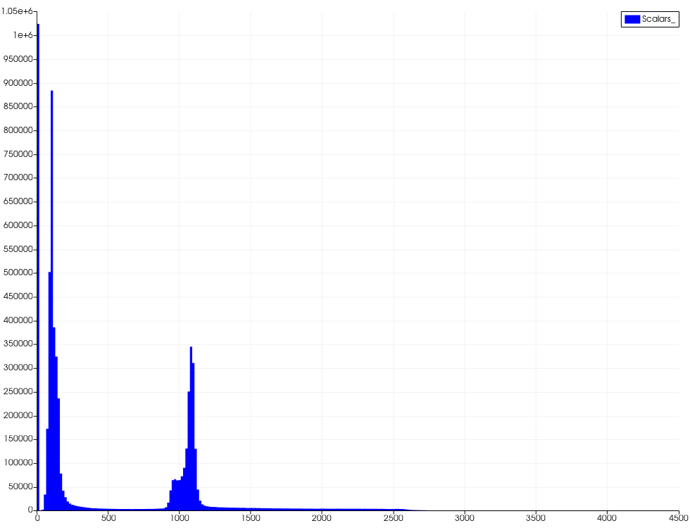
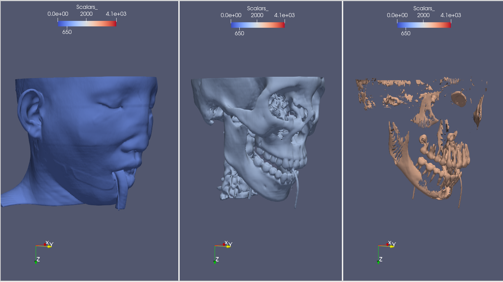
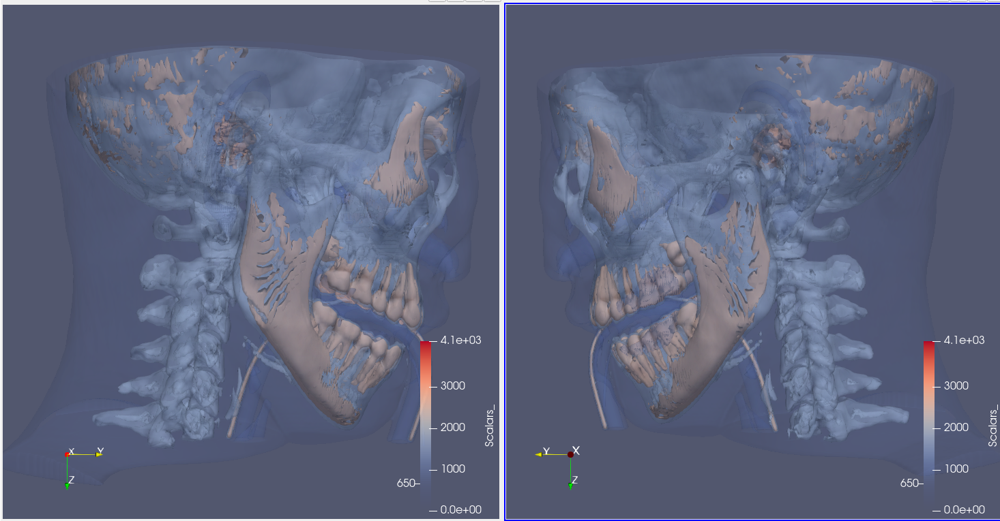
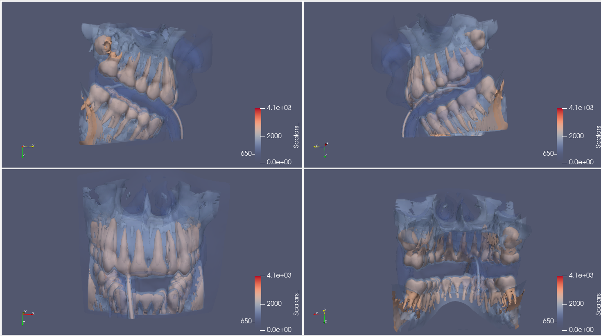
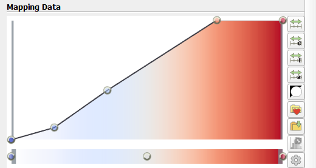

---
elm:
  dependencies:
    gicentre/elm-vegalite: latest

narrative-schemas:
  - coursework
---

Author: Perikleous Michalis (985936)

{(aim|}
The aim of this visualization is to show the three surfaces of human head and some dentical concepts for the given dataset.
{|aim)}

{(vistype|}
For this visualization we used **isosurfaces**
{|vistype)}

# Data Preparation

For this visualization we firstly produce three different isosurfaces in order to see and understand the human head dataset. The isosurfaces produced after an understanding of the **histogram** of the dataset.

### Three Isosurfaces

Using values 650 for the flesh, 1450 for bones and 2580 for teeth we can see the structure of the human head. The density for teeth are higher than density of bones and bones' density are higher than flesh. Thus we can seperate each one of them in three different visualizations.

From the tube in the mouth of the person we can assume that is under some sort of **gastroscopy**.

### Combined Isosurfaces

For a better visualization of the dentical condition of the preson we produced a combined isosurface model using **contour filter** with the same values for each isosurface.

Reducing the opacity of flesh at 0.2 and the opacity of bones at 0.4 we can identify that wisdom teeth are not yet fully developed.

### Final visualization

For a closer and more clear visualization, using **clip filter** we try to focus on the area that we are mostly interest. So for the final visualization we produced several views of the clipped mouth of the patient.

## Final Visualization

From the final visualization we can see that the right wisdom teeth is developping on the other tooth that is next to it. We can also see that the left wisdom tooth is not yet developed and is also developing on wrong direction. One of the down incisors is not at the same deepth as the others and therefore there is also problem there.

{(vismapping|}

|                  |Final Visualization        |
|:----------------:|:-------------------------:|
|**threshold**     |0-4095                     |
|**color**         |Image Color: **Cool to Warm**   Custom manipulations of the transfer function to change opacity on core values|
|**opacity**|**Surface 650**:  0.2 (*Flesh*)  **Surface 1450**: 0.4 (*Bones*)  **Surface 2580**: 1 (*Teeth*)|

{|vismapping)}

{(dataprep|}
Initially using the **histogram** of the dataset we decide to produce three different isosurfaces using **contour filter**. Afterwards we combined the isosurfaces an we identified some problems with the dentical development of the person. Finally, reducing the opacity and clipping only the box we were interested we created our final visualization that is the mouth of the person from 4 different views.
{|dataprep)}

{(limitations|}
Having a general dataset about the head of a person the color mapping was not optimal to indentify some issues with a dentical prospective. A better contradiction between bones and teeth and a series of filters to produce a panoramic version of mouth from several view would lead to more robust result regarding our aim.
{|limitations)}
