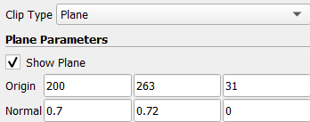

{(aim|}
This visualization shows the material difference of teddy bear. The three different isosurfaces match 3 materials for outer layer of the teddy bear, the material inside the teddy bear and the material for the eyes and nose.
{|aim)}

{(vistype|}
For this visualization we used **isosurfaces**
{|vistype)}

# Data Preparation

For this visualization we extended our dataset by setting the data spacing of z axis to 5. Afterwards we used **contour filter** to identify the three different values that best describe the layers of the teddy bear.

### Three Isosurfaces

We produced 3 different isosurfaces for outer layer the inside and eyes and nose with values **42, 190** and **746** respectively. As we can see the density for eyes and nose are much higher than the other two indicating that the material was much harder than the outer and inside materials.

Afterwards, we merge the three isosurfaces and using a **clip filter** we produce our final visualization.

 &nbsp;&nbsp;&nbsp;&nbsp;&nbsp;&nbsp;&nbsp;&nbsp;&nbsp;&nbsp;&nbsp;

## Final Visualization

In the final visualization we can dinstinguish the 3 different layers and which one is above the other. The inside material is used to give the shape of the teddy bear.

{(vismapping|}

|                  |Final Visualization        |
|:----------------:|:-------------------------:|
|**threshold**     |0-1492                     |
|**color**         |**Surface 42**:  #AA5500 (*Outer Layer*)  **Surface 190**: #AAAAFF (*Inner Layer*)  **Surface 746**: #FFFF00 (*Eyes & Nose*)|
|**data spacing**|**x** : 1 **y** :1 **z** :5|
|**representation**|surface **for all**|

{|vismapping)}

{(dataprep|}
Initially we **extend** the dataset on **z axis by 5**. Using the **contour filter** we created three seperate isosurfaces. Visualizing the seperated isosurfaces we then create a signle visualization containing all of them. Afterwards, we found two **clips** between the dataset in order to cut it through the eyes in order for all layers to be visible.
{|dataprep)}

{(limitations|}
The limitations of this visualization is that because the isosurfaces are not complete, there are some points that the layers are not visible. Also we only distinguish the materials but we do not exactly know what are they and we colored them with random colors.
{|limitations)}
