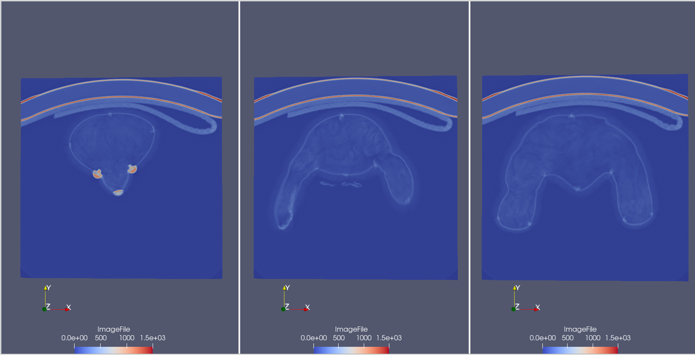
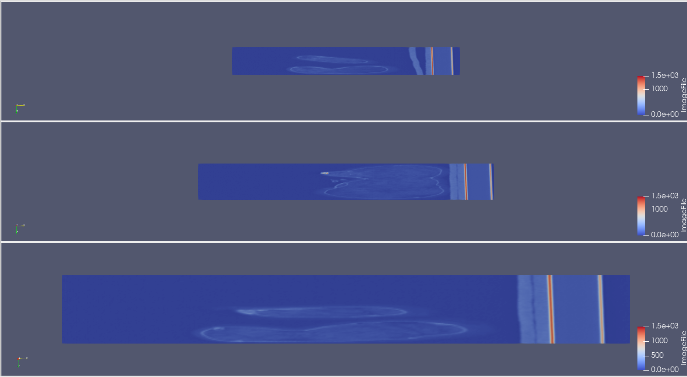
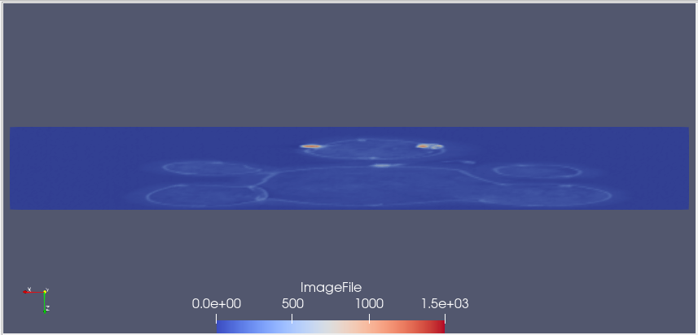
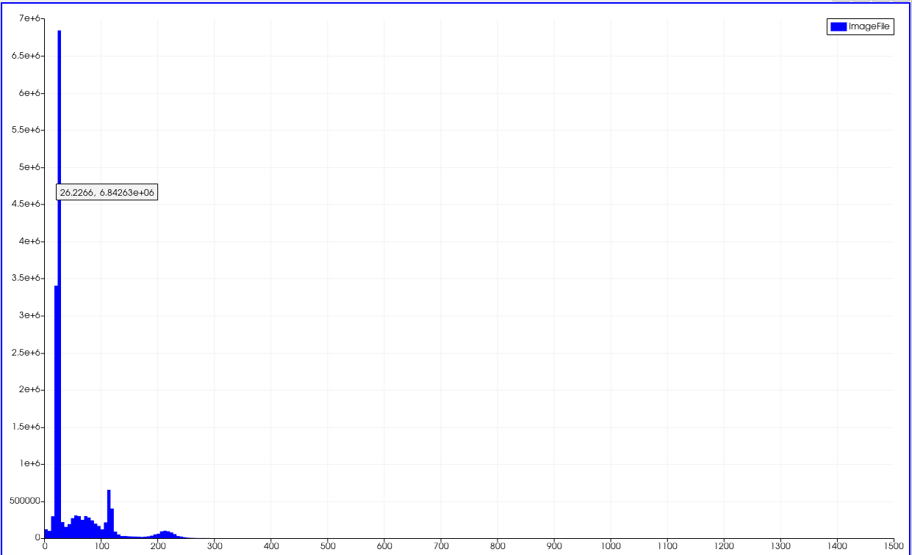
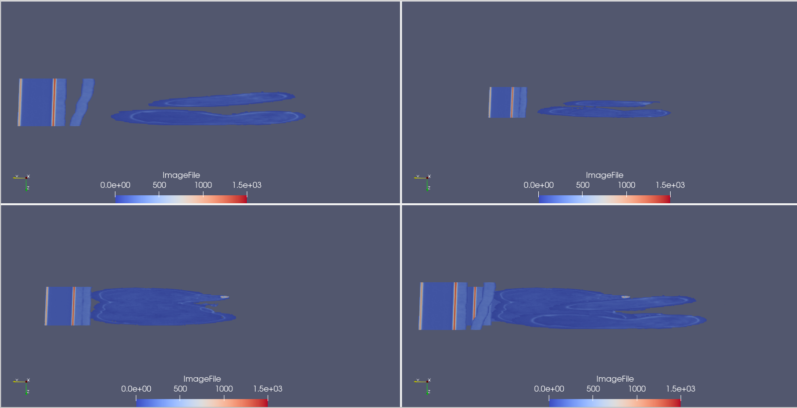
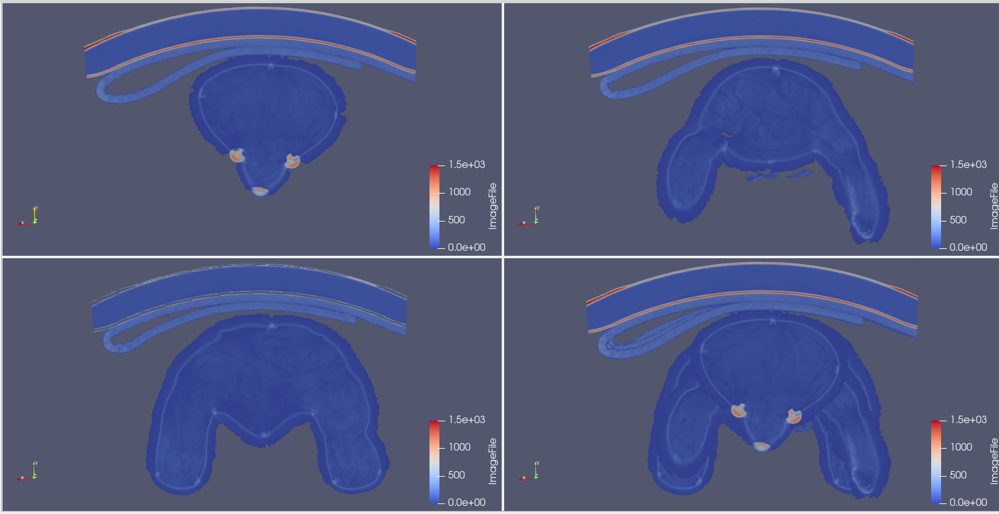
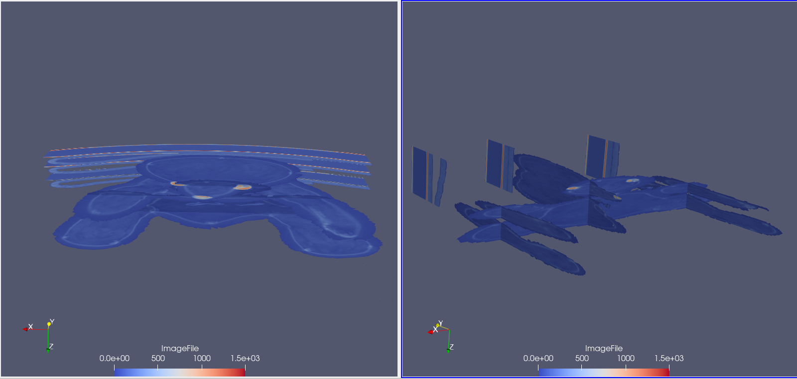

{(aim|}
This visualization aims to show that the datasets contains a **teddy bear**. With a series of slices we will visualize the **teddy bear** that is hidden in the file.
{|aim)}

{(vistype|}
For this visualization we used **slices**
{|vistype)}

# Data Preparation

The process we followed for this visualization was a continuous slice of the dataset at several x,y,z coordinates in order to find the optimal slices for the understanding of the dataset.   **All slices below keep the middle value to the other two remaining axis.**

### Slices on Z axis

Firstly we sliced the dataset through **z axis** and we found three interesting slices that provides information about the insight of the dataset. In the following picture we show the slices on z axis for values **15, 31, 54** respectively. From the first slice we can obviously see that there is a head that looks like a bear. The second and third slices shows something like arms and legs respectively.

### Slices on X axis

By slicing the dataset on x axis we identified and confirmed that it is a bear. First slice at value **375** shows the one side of hand and leg, while another cut at value **100** also shows the hand and leg. The second slice confirm the shape of the head of the bear.

### Slice on Y axis

Just one slice on Y axis at value **270** shows all parts of the bear.

## Final Visualization

Having a look at the **histogram**, for the final visualization we firstly applied a threshold filter on the slices and then we merged them together for a clearer representation of the teddy bear.

#### X axis from both sides

#### Z axis visualization

#### Y axis combined with the other two

{(vismapping|}

|                  |X axis Visualization       |Z axis Visualization       |Y axis Visualization       |
|:----------------:|:-------------------------:|:-------------------------:|:-------------------------:|
|**threshold**     |30-1492                    |30-1492                    |30-1492                    |
|**color**         |ImageFile: **Cool to Warm**|ImageFile: **Cool to Warm**|ImageFile: **Cool to Warm**|
|**slice1**        |**x:** 100 **y:** 255.5 **z:** 31|**x:** 255.5 **y:** 255.5 **z:** 15|**x:** 255.5 **y:** 270 **z:** 31 and combination of the previous two|
|**slice2**        |**x:** 260 **y:** 255.5 **z:** 31|**x:** 255.5 **y:** 255.5 **z:** 31|**N/A**      |
|**slice1**        |**x:** 375 **y:** 255.5 **z:** 31|**x:** 255.5 **y:** 255.5 **z:** 54|**N/A**      |

{|vismapping)}

{(dataprep|}
For this visualization we firstly found the optimal slices for each of the three axis. For Z axis we sliced the dataset 3 times to identify the head, arms and legs. For the x axis we sliced the dataset 3 times to identify left arm and leg, right arm and leg and the head of the teddy bear. Afterwards, based on the histogram we used **threshold filter** to remove the areas around the bear by removing voxels that its value was under 30. At the final step we combined the slices for each axis to identify the bear.
{|dataprep)}

{(limitations|}
For this visualization we used **slice filter**. Having a volume datasets, slices might not be the optimal way to represent what it is inside. This visualization also limit us to understand the actual size of the bear. For instance how big it is the arm and leg. Filter to identify the volume of the bear or using several slices at the begining and end or each arm and leg may lead to better results.
{|limitations)}
