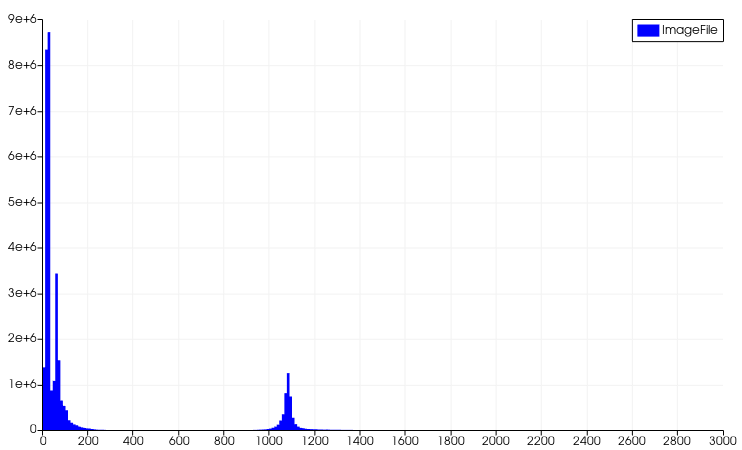
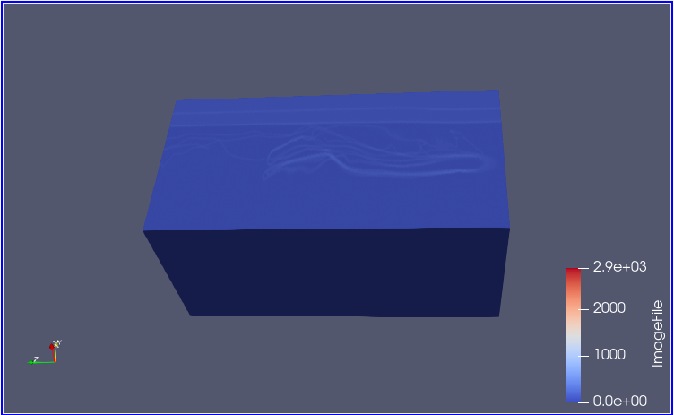
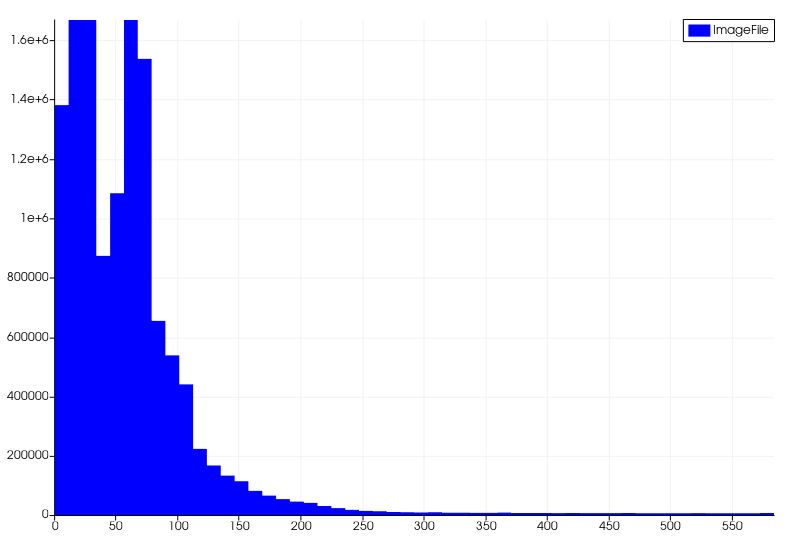
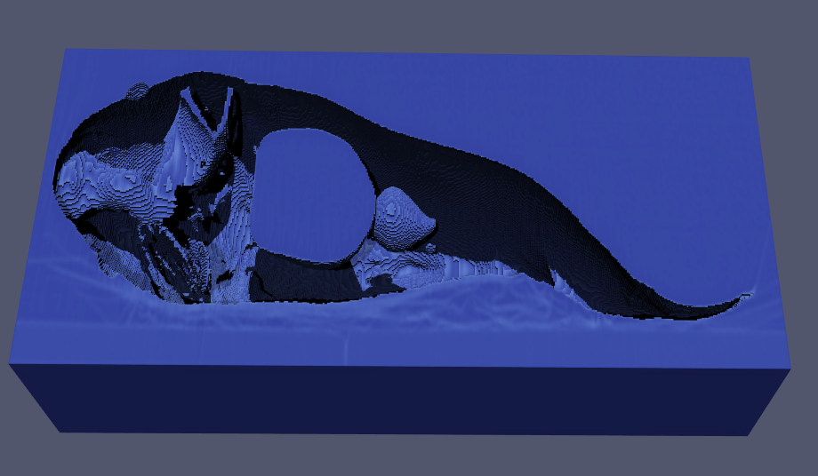
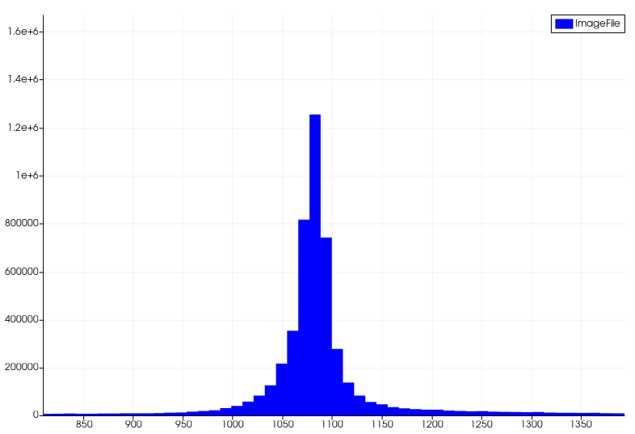
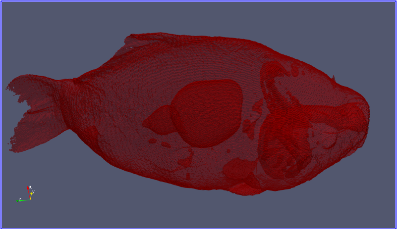
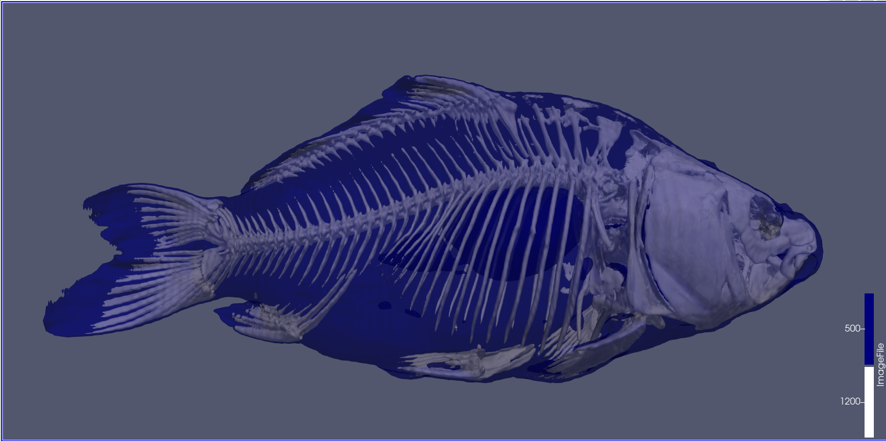
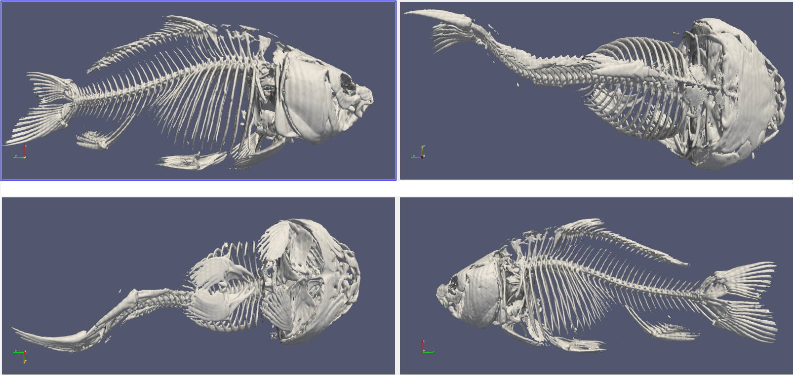
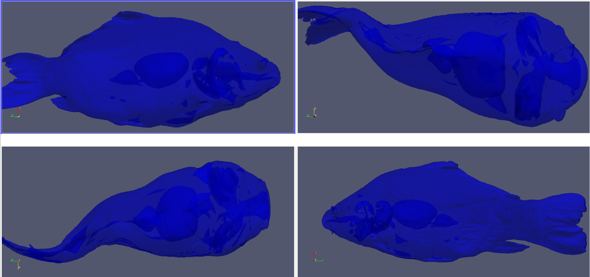

{(aim|}
This visualization illustrates the **bones** and **flesh** of the fish in two distinct `isosurfaces` for a better understanding of its **anatomy**.
{|aim)}

{(vistype|}
For this visualization we used **isosurfaces**
{|vistype)}

# Data Preparation

Firstly we produced a **histogram** in order to see the distribution of the numerical data of the dataset. From the following histogram we can distinguish two different density curves.

 

## Threshold from 0 to 500

By setting a threshold ranging between **0** and **500**, and then using **clip** and enabling **ray tracing with shadows** we notice that there is a fish volume inside the dataset represented by the inverse of the threshold.

 

## Threshold from 500 to 2871

Using the invert of the threshold we visualized the fish in the dataset. Setting a **solid color** and the **opacity** to **0.4** we found that inside the fish there are some organs as well. Knowing all the above we produce our final visualization.

## Final Visualization

For the final visualization we aim to show the **anatomy** of the specific fish. Using two distinct isosurfaces we present the bones anatomy and some organs that are visual from our dataset.

#### Bones and flesh surfaces

#### Bone surface

#### Flesh surface

{(vismapping|}

|             |0-500 Threshold          |500-2871 Threshold|Bones and Flesh   |Bones surface     |Flesh surface     |
|:-----------:|:-----------------------:|:----------------:|:----------------:|:----------------:|:----------------:|
|**threshold**|0-500                    |500-2871          |0-2871            |0-2871            |0-2871            |
|**color**    |**Image File**: Cool to Warm|**Solid Color**: #AA0000 |**Surface 1200**:  #FFFFFF (*Bones*)  **Surface 500**: #0000FF (*Flesh*)|**Solid Color**: #FFFFFF (*Bones*)|**Solid Color**: #0000FF (*Flesh*)   |
|**opacity**  |1|0.4|**Surface 1200**: 0.7 (*Bones*)   **Surface 500**: 0.5 (*Flesh*) |1|0.5|
|**representation**   |surface|surface|surface|surface|surface|
|**shadows**   |enable|disable|disable|disable|disable|

{|vismapping)}

{(dataprep|}
Firstly we visualized the dataset using histogram in order to extract some usefull information. After the understanding of the dataset, for the final visualizations we used **contour filter** with two isosurfaces to distinguish **bones** and **flesh** at **1200** and **500** respectively. Using a transfer function we coloured bones with solid white color and flesh with solid blue color. The opacity is set to 0.7 for bones and 0.5 to flesh to have a clear insight of our isosurfaces.
{|dataprep)}

{(limitations|}
Despite the fact the with this visualization we can see the anatomy of the bones and some organs, we cannot have a clear insight of these organs and what they might be or how they connect to each other. Also an interactive approach to remove specific bones or organs would lead to better visualization.
{|limitations)}
