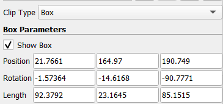

{(aim|}
This visualization shows the position of several **fins** of the fish and the **swim bladder** (fish organ).
{|aim)}

{(vistype|}
For this visualization we used **clips**
{|vistype)}

# Data Preparation

Firstly using the **contour filter** we produced an isosurface using the flesh of the fish (**value 500**). Afterwards with a series of clip filters we extracted the organ of the fish seperatly as shown in the following pictures (order of clips matches the images below).

#### Clip 1 & 2
 

#### Clip 3 & 4
 

At the end using **clip we cut** the organ in **half** as shown in the following picture. We also noticed a connection between the two mass indicating that this must be the **swim bladder**.

## Seperate fin clips

Afterwards we on the contour filter, using several clips we are cutting every fin of the fish in a seperate fin.

#### Organ and Dorsal fin

 

#### Caudal and Anal fin

 

#### Pelvic and Pectoral fin

 

## Final Visualization

For the final visualization we aim to show the several **fins** of the specific fish along with the **swim bladder** that was extracted from the dataset. Using all distinct clips in a single visualization we achieved the following.

#### Fins and swim bladder

{(vismapping|}

|                  |Left Visualization          |Right Visualization      |
|:----------------:|:--------------------------:|:-----------------------:|
|**threshold**     |0-2871                      |0-2871                   |
|**color**         |**contour filter**: #FFFF7F   **clip5**: #00FFFF   **clip6**: #FFAA00   **clip7**: #FF5500   **clip8**: #FFFF00   **clip9**: #FF0000   **clip10**: #0000FF|**clip5**: #00FFFF   **clip6**: #FFAA00   **clip7**: #FF5500   **clip8**: #FFFF00   **clip9**: #FF0000   **clip10**: #0000FF |
|**opacity**       |**countour filter**: 0.2   **all clips**: 1|**all clips**: 1   |
|**specular**      |0.5 **for all**                               |0.5 **for all**    |
|**representation**|surface **for all**                           |surface **for all**|

{|vismapping)}

{(dataprep|}
Firstly we used the **contour filter** with one isosurface at value 500 to extract the **flesh** of the fish. Afterwards, using a **series of consecutive clips** on one another we extracted the **swim bladder**, the only visible organ of the fish. Next, on the initial contour filter using clip filter (mostly `box` type) we extracted all visible and known fins of the fish.
{|dataprep)}

{(limitations|}
Due to the lack of interactivity on the components of the fish, this visualization cannot stand alone in order to provide infomration about the name of each individual fin. Also the length of each of this fins is not visible. Hence we cannot identify the actual scale of this fish. 
{|limitations)}
